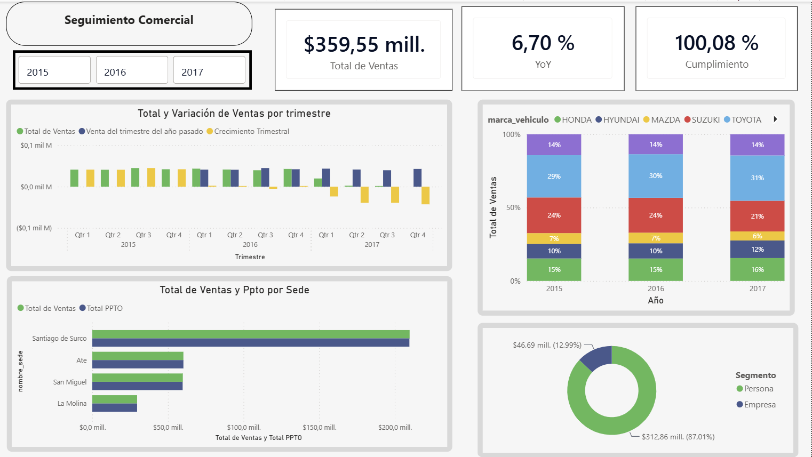
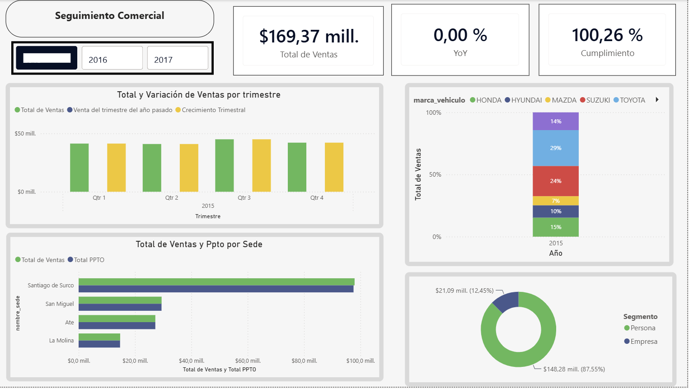
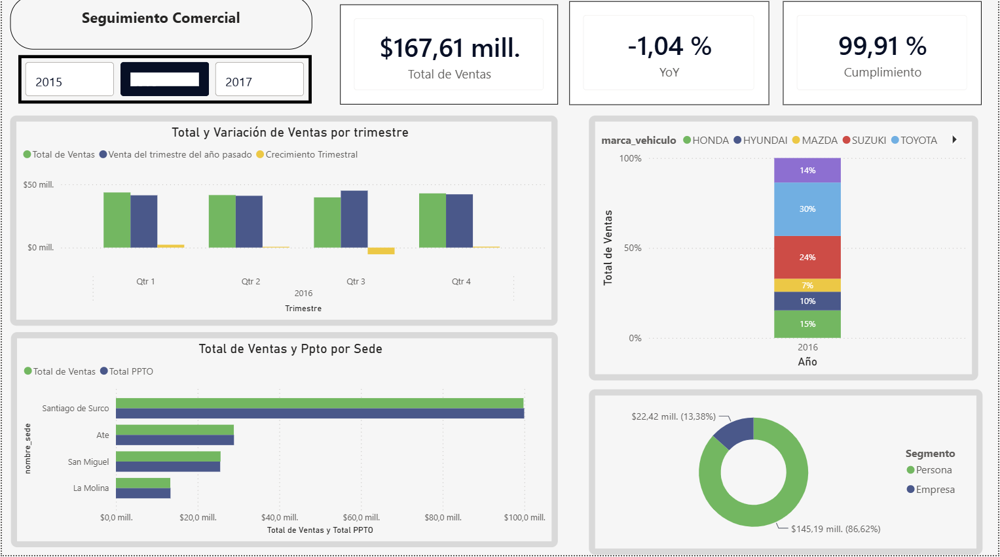
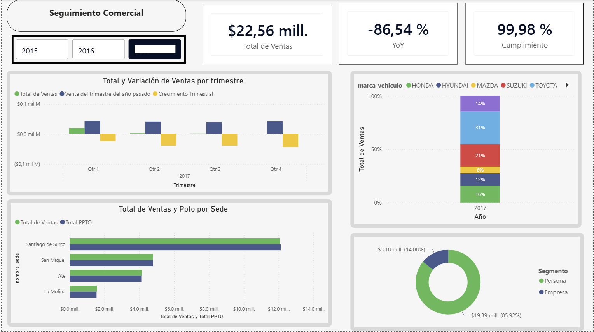

# 🚗 Commercial Sales Dashboard



## 📖 Project Overview

The **Commercial Sales Dashboard** is an interactive Business Intelligence project developed in Power BI to analyze the commercial performance of a fictional vehicle dealership.

This project was created entirely for **learning and portfolio purposes**. All data used in this analysis is simulated and does not belong to a real company.

The dashboard provides a consolidated view of sales performance, budget achievement, customer behavior, vehicle brand performance, and quarterly trends.

---
## 📸 Dashboard Preview

### 2015 Analysis



### 2016 Analysis



### 2017 Analysis



## 🎯 Business Objective

The main objective of this project is to transform raw commercial data into actionable business information that can support decision-making.

The analysis focuses on questions such as:

- How are sales performing against the established budget?
- Which vehicle brands generate the highest sales?
- How does sales performance change over time?
- Which customer segments contribute most to sales?
- How does sales performance compare with the previous year?
- Which quarters show the strongest and weakest commercial performance?

---

## 🗂️ Dataset

The dataset was **created specifically for this project** and represents a fictional vehicle dealership.

The data was structured to simulate a real-world commercial environment, including information related to:

- Customers
- Vehicles
- Vehicle brands
- Sales transactions
- Dates
- Sales targets and budgets

The dataset does not represent a real company or real customers.

---

## 🏗️ Data Model

The project uses a **Star Schema** data model designed to separate transactional data from descriptive dimensions.

### Fact Tables

The main fact tables are:

- **Fact_Ventas** — Contains sales transactions and commercial metrics.
- **fact_presupuestos** — Contains budget and target information.

### Dimension Tables

The model includes dimensions such as:

- **DimFechas** — Date and time analysis.
- **dim_cliente** — Customer information.
- **dim_vehiculo** — Vehicle, brand, model, and vehicle type information.
- **dim_sede** — Branch information.
- **Dim_Vendedor** — Salesperson information.
- **dim_canal** — Sales channel information.

This structure allows sales performance to be analyzed across multiple business dimensions, including time, customers, vehicles, branches, salespeople, and sales channels.

---

## 📊 Key Performance Indicators

The dashboard focuses on several key commercial indicators, including:

- Total Sales
- Budget Achievement
- Year-over-Year Sales Performance
- Quarterly Sales Performance
- Sales by Vehicle Brand
- Customer Segmentation

These indicators provide a high-level view of business performance while allowing users to explore the underlying information interactively.

---

## 🧮 DAX Measures

DAX was used to create dynamic measures for the analysis of sales performance, budget achievement, and year-over-year growth.

### Total Sales

Calculates the total sales value using the sales price excluding VAT (IGV).

```DAX
Total de Ventas =
SUM(Fact_Ventas[Precio Venta sin IGV])
```

### Budget Achievement

Measures actual sales relative to the established budget.

```DAX
Cumplimiento =
DIVIDE(
    [Total de Ventas],
    [Total PPTO]
)
```

### Year-over-Year Growth

Calculates the percentage change in sales compared with the same period in the previous year.

```DAX
YoY =
VAR VentasLY =
    CALCULATE(
        [Total de Ventas],
        DATEADD(DimFechas[Date], -1, YEAR)
    )
RETURN
    DIVIDE(
        [Total de Ventas] - VentasLY,
        VentasLY,
        0
    )
```

These measures allow the dashboard to dynamically evaluate sales performance according to the selected time periods and filters.

---

## 🔄 Data Transformation

Power Query was used to prepare and transform the data before loading it into the analytical model.

The preparation process included tasks such as:

- Data cleaning
- Data type transformation
- Column preparation
- Data standardization
- Structuring tables for the analytical model

The objective was to ensure that the data was consistent and ready for analysis.

---

## 💡 Business Insights

The dashboard was designed to identify relevant commercial patterns and support data-driven decision-making.

### Key Conclusions

Based on the analysis presented in the dashboard, several relevant commercial patterns can be identified:

- **Overall sales performance is positive:** Total sales reached approximately 359.55 million, with an overall YoY growth of 6.70% and budget achievement of 100.08%.
- **Strong budget performance:** Actual sales are closely aligned with the established budget, indicating effective commercial performance against planned targets.
- **High sales concentration by branch:** Santiago de Surco represents the largest sales contribution among the analyzed branches, significantly exceeding the other locations.
- **Customer concentration:** The Persona segment accounts for approximately 87% of total sales, while the Empresa segment contributes around 13%.
- **Vehicle brand concentration:** Toyota represents one of the largest shares of sales, followed by other relevant brands such as Suzuki and Honda.
- **Year-to-year variations require context:** The dashboard shows significant changes in YoY performance for individual years. These variations should be interpreted together with the period covered by the available data to avoid misleading conclusions.

### Business Recommendations

Based on these findings, the fictional dealership could consider the following actions:

1. **Reduce geographic concentration risk**

   Analyze the performance of lower-performing branches and identify opportunities to replicate the commercial practices observed in Santiago de Surco.

2. **Strengthen the corporate customer segment**

   Since most sales come from individual customers, developing specific commercial strategies for corporate customers could help diversify the revenue base.

3. **Monitor vehicle brand performance**

   Track sales, growth, and market share by brand on a regular basis to identify high-performing brands and opportunities for portfolio optimization.

4. **Improve periodic performance monitoring**

   Establish monthly or quarterly monitoring of sales versus budget and previous-year performance to identify deviations early and support faster decision-making.

5. **Validate data coverage before evaluating annual performance**

   Before interpreting large YoY variations, confirm that the periods being compared contain equivalent time coverage. This helps distinguish actual business performance changes from differences in data availability.

### Overall Assessment

The dashboard indicates a business with strong budget alignment and positive overall sales growth, but also highlights opportunities related to customer diversification, branch performance, and continuous monitoring of commercial trends.

The analysis demonstrates how Power BI can be used to transform transactional data into actionable business information and support data-driven decision-making.

## 🛠️ Tools & Technologies

- **Power BI** — Dashboard development and data visualization
- **DAX** — Analytical measures and calculations
- **Power Query** — Data transformation and preparation
- **Data Modeling** — Star Schema
- **GitHub** — Project documentation and versioning

---

## ⚠️ Disclaimer

This project is a **fictional business simulation created exclusively for educational and portfolio purposes**.

All data, entities, customers, vehicles, transactions, and business results are simulated and do not represent a real company or real-world commercial information.

---

## 👨‍💻 Author

**Miguel Montoya**

Economist | Aspiring Data Analyst

Interested in Data Analytics, Business Intelligence, SQL, Power BI, Python, and data-driven decision-making.
